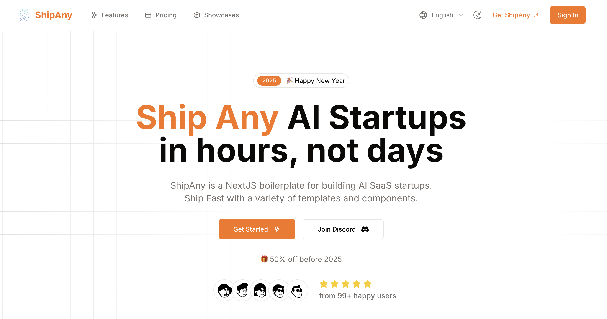

# 🧮 Height Calculator - 儿童身高预测系统

一个基于多种科学算法的专业儿童身高预测和成长分析平台，提供准确的身高预测、BMI分析、成长建议和PDF报告生成功能。



## 📋 项目概述

### 🎯 核心功能
- **多算法身高预测**：集成 Khamis-Roche 改良法、中位父母身高法、百分位追踪法
- **专业成长分析**：BMI 分析、成长阶段评估、百分位计算
- **可视化图表**：成长曲线图、预测趋势图
- **个性化报告**：PDF 格式的专业成长报告
- **多语言支持**：中文/英文双语界面
- **单位转换**：公制/英制自动转换

### 🏗️ 技术架构
- **前端框架**：Next.js 15.2.3 + React 18.3.1
- **UI 组件库**：Radix UI + Tailwind CSS + shadcn/ui
- **状态管理**：React Hooks + Context API
- **国际化**：next-intl
- **认证系统**：NextAuth.js + Supabase
- **支付系统**：Stripe
- **数据库**：Supabase (PostgreSQL)
- **部署平台**：Vercel + Cloudflare Pages

## 🗂️ 项目结构

```
height-calculator/
├── 📁 app/                          # Next.js App Router
│   ├── 📁 [locale]/                 # 国际化路由
│   │   ├── 📁 (default)/            # 默认布局组
│   │   │   ├── 📁 function/         # 身高计算器主功能
│   │   │   │   ├── 📁 components/   # 功能组件
│   │   │   │   │   ├── HeightForm.tsx      # 身高输入表单
│   │   │   │   │   ├── ResultPanel.tsx     # 结果展示面板
│   │   │   │   │   └── GrowthChart.tsx     # 成长曲线图
│   │   │   │   └── page.tsx         # 主功能页面
│   │   │   ├── 📁 posts/            # 博客文章
│   │   │   └── page.tsx             # 首页
│   │   ├── 📁 (admin)/              # 管理后台
│   │   ├── 📁 (console)/            # 用户控制台
│   │   │   ├── 📁 api-keys/         # API 密钥管理
│   │   │   ├── 📁 my-credits/       # 积分管理
│   │   │   ├── 📁 my-invites/       # 邀请管理
│   │   │   └── 📁 my-orders/        # 订单管理
│   │   └── 📁 auth/                 # 认证页面
│   ├── 📁 api/                      # API 路由
│   │   ├── 📁 auth/                 # 认证 API
│   │   ├── 📁 checkout/             # 支付结账
│   │   ├── 📁 stripe-notify/        # Stripe 回调
│   │   └── 📁 demo/                 # AI 功能演示
│   ├── globals.css                  # 全局样式
│   └── theme.css                    # 主题样式
├── 📁 components/                   # 公共组件库
│   ├── 📁 ui/                       # UI 基础组件
│   ├── 📁 blocks/                   # 页面区块组件
│   ├── 📁 dashboard/                # 仪表板组件
│   └── 📁 console/                  # 控制台组件
├── 📁 types/                        # TypeScript 类型定义
│   ├── height.types.ts              # 身高计算相关类型
│   ├── user.d.ts                    # 用户类型
│   └── order.d.ts                   # 订单类型
├── 📁 utils/                        # 工具函数
│   ├── height-calculations.ts       # 身高预测算法
│   └── pdf-generator.ts             # PDF 报告生成
├── 📁 models/                       # 数据模型
│   ├── db.ts                        # 数据库连接
│   ├── user.ts                      # 用户模型
│   ├── order.ts                     # 订单模型
│   └── credit.ts                    # 积分模型
├── 📁 services/                     # 业务逻辑服务
│   ├── user.ts                      # 用户服务
│   ├── order.ts                     # 订单服务
│   └── credit.ts                    # 积分服务
├── 📁 auth/                         # 认证配置
│   ├── config.ts                    # NextAuth 配置
│   └── index.ts                     # 认证入口
├── 📁 i18n/                         # 国际化配置
│   ├── 📁 messages/                 # 翻译文件
│   │   ├── en.json                  # 英文翻译
│   │   └── zh.json                  # 中文翻译
│   └── 📁 pages/                    # 页面级翻译
├── 📁 aisdk/                        # AI SDK 集成
│   ├── 📁 kling/                    # 可灵 AI
│   └── 📁 generate-video/           # 视频生成
└── 📁 public/                       # 静态资源
    └── 📁 imgs/                     # 图片资源
```

## 🧠 核心算法实现

### 1. Khamis-Roche 改良法
```typescript
function khamisRocheMethod(data: HeightCalculatorData): AlgorithmResult {
  const { gender, currentHeight, fatherHeight, motherHeight } = data;
  const ageYears = calculateAgeInYears(data.birthDate);
  
  // 中位父母身高计算
  const midParentalHeight = gender === 'male' 
    ? (fatherHeight + motherHeight + 13) / 2
    : (fatherHeight + motherHeight - 13) / 2;
  
  // 年龄修正系数 + 百分位调整
  const prediction = midParentalHeight * 0.6 + currentHeight * ageCorrection + percentileAdjustment;
  
  return {
    name: 'Khamis-Roche 改良法',
    predictedHeight: Math.round(prediction * 10) / 10,
    confidence: 90, // 2-16岁高置信度
    description: '基于父母身高、当前身高和年龄的综合预测模型'
  };
}
```

### 2. 中位父母身高法
```typescript
function midParentalMethod(data: HeightCalculatorData): AlgorithmResult {
  const { gender, fatherHeight, motherHeight } = data;
  
  const prediction = gender === 'male' 
    ? (fatherHeight + motherHeight + 13) / 2  // 男孩 +13cm
    : (fatherHeight + motherHeight - 13) / 2; // 女孩 -13cm
  
  return {
    name: '中位父母身高法',
    predictedHeight: Math.round(prediction * 10) / 10,
    confidence: 75,
    description: '基于父母身高的简化预测方法，遗传因素占主导'
  };
}
```

### 3. 百分位追踪法
```typescript
function percentileTrackingMethod(data: HeightCalculatorData): AlgorithmResult {
  const currentPercentile = calculateHeightPercentile(currentHeight, ageMonths, gender);
  
  // 假设保持当前百分位到成年
  const adultStandard = WHO_HEIGHT_STANDARDS[WHO_HEIGHT_STANDARDS.length - 1];
  const prediction = getHeightByPercentile(adultStandard, currentPercentile, gender);
  
  return {
    name: '百分位追踪法',
    predictedHeight: Math.round(prediction * 10) / 10,
    confidence: 80,
    description: '假设儿童保持当前身高百分位直至成年的预测方法'
  };
}
```

## 💾 数据模型设计

### 身高计算数据模型
```typescript
export interface HeightCalculatorData {
  gender: 'male' | 'female';           // 性别
  birthDate: Date;                     // 出生日期
  currentHeight: number;               // 当前身高 (cm)
  currentWeight: number;               // 当前体重 (kg)
  fatherHeight: number;                // 父亲身高 (cm)
  motherHeight: number;                // 母亲身高 (cm)
  unit: 'metric' | 'imperial';         // 测量单位
}

export interface PredictionResult {
  primaryPrediction: number;           // 主预测结果
  predictionRange: [number, number];   // 预测范围
  currentPercentile: number;           // 当前百分位
  confidence: number;                  // 置信度
  algorithms: AlgorithmResult[];       // 各算法结果
  bmiAnalysis: BMIAnalysis;           // BMI 分析
  growthStage: GrowthStage;           // 成长阶段
}
```

### 用户系统数据模型
```typescript
export interface User {
  uuid: string;                        // 用户唯一标识
  email: string;                       // 邮箱
  nickname: string;                    // 昵称
  avatar_url: string;                  // 头像
  signin_type: string;                 // 登录类型
  signin_provider: string;             // 登录提供商
  created_at: string;                  // 创建时间
}

export interface Order {
  order_no: string;                    // 订单号
  user_uuid: string;                   // 用户ID
  amount: number;                      // 金额
  currency: string;                    // 货币
  status: string;                      // 状态
  credits: number;                     // 积分
  interval: string;                    // 订阅周期
}
```

## 🎨 UI/UX 设计特色

### 1. 响应式设计
- 移动端优先设计原则
- 支持桌面、平板、手机多端适配
- 流畅的动画和交互效果

### 2. 组件化架构
```typescript
// 表单组件结构
<HeightForm>
  ├── ProgressIndicator     // 进度指示器
  ├── UnitToggle           // 单位切换
  ├── ChildInfoSection     // 儿童信息区
  ├── ParentInfoSection    // 父母信息区
  └── SubmitSection        // 提交区域
</HeightForm>

// 结果展示组件
<ResultPanel>
  ├── PredictionSummary    // 预测摘要
  ├── AlgorithmComparison  // 算法对比
  ├── BMIAnalysis         // BMI 分析
  ├── GrowthChart         // 成长曲线
  └── RecommendationCard  // 建议卡片
</ResultPanel>
```

### 3. 主题系统
- 支持亮色/暗色主题切换
- 基于 CSS 变量的主题系统
- shadcn/ui 组件库集成

## 🔐 认证与权限系统

### NextAuth.js 集成
```typescript
export const authOptions: NextAuthConfig = {
  providers: [
    GoogleProvider({
      clientId: process.env.GOOGLE_CLIENT_ID!,
      clientSecret: process.env.GOOGLE_CLIENT_SECRET!,
    }),
    // 其他 OAuth 提供商...
  ],
  callbacks: {
    async jwt({ token, user, account }) {
      // JWT 令牌处理
      if (user && account) {
        const dbUser = await saveUser(userFromOAuth);
        token.user = dbUser;
      }
      return token;
    },
    async session({ session, token }) {
      // 会话处理
      session.user = token.user;
      return session;
    },
  },
};
```

### 权限控制
- 基于角色的访问控制 (RBAC)
- 路由级别的权限保护
- API 接口权限验证

## 💳 支付系统集成

### Stripe 支付流程
1. **创建订单**：`/api/checkout` - 创建 Stripe 结账会话
2. **支付处理**：Stripe 托管支付页面
3. **回调处理**：`/api/stripe-notify` - 处理支付成功回调
4. **积分发放**：自动为用户账户增加积分

### 支持的支付方式
- 信用卡/借记卡
- 支付宝 (中国地区)
- 微信支付 (中国地区)
- 订阅/一次性支付

## 🌍 国际化系统

### next-intl 配置
```typescript
// 支持的语言
const locales = ['en', 'zh'] as const;

// 翻译文件结构
i18n/
├── messages/
│   ├── en.json              # 英文翻译
│   └── zh.json              # 中文翻译
└── pages/
    └── landing/
        ├── en.json          # 首页英文翻译
        └── zh.json          # 首页中文翻译
```

### 动态路由国际化
- 路由格式：`/[locale]/function`
- 自动语言检测
- SEO 友好的多语言 URL

## 🚀 部署配置

### Vercel 部署
```json
// vercel.json
{
  "functions": {
    "app/api/**/*": {
      "maxDuration": 60
    }
  }
}
```

### Cloudflare Pages 部署
```toml
# wrangler.toml
name = "height-calculator"
compatibility_date = "2024-01-01"

[vars]
NODE_ENV = "production"
NEXT_PUBLIC_WEB_URL = "https://your-domain.com"
```

### 环境变量配置
```bash
# 数据库
SUPABASE_URL=your_supabase_url
SUPABASE_ANON_KEY=your_supabase_anon_key

# 认证
NEXTAUTH_SECRET=your_nextauth_secret
NEXTAUTH_URL=your_domain
GOOGLE_CLIENT_ID=your_google_client_id
GOOGLE_CLIENT_SECRET=your_google_client_secret

# 支付
STRIPE_PRIVATE_KEY=your_stripe_private_key
STRIPE_WEBHOOK_SECRET=your_stripe_webhook_secret

# AI 服务
OPENAI_API_KEY=your_openai_api_key
DEEPSEEK_API_KEY=your_deepseek_api_key
```

## 🛠️ 开发指南

### 本地开发环境设置
```bash
# 1. 克隆项目
git clone <your-repo-url>
cd height-calculator

# 2. 安装依赖
npm install --legacy-peer-deps

# 3. 配置环境变量
cp .env.example .env.local

# 4. 启动开发服务器
npm run dev
```

### 项目脚本
```json
{
  "scripts": {
    "dev": "next dev",           // 开发服务器
    "build": "next build",       // 构建生产版本
    "start": "next start",       // 启动生产服务器
    "lint": "next lint"          // 代码检查
  }
}
```

### 代码规范
- **TypeScript**：严格类型检查
- **ESLint**：代码质量检查
- **Prettier**：代码格式化
- **Husky**：Git hooks

## 📊 性能优化

### 构建优化
- **代码分割**：路由级别的懒加载
- **图片优化**：Next.js Image 组件
- **Bundle 分析**：@next/bundle-analyzer
- **Tree Shaking**：自动移除未使用代码

### 运行时优化
- **缓存策略**：API 响应缓存
- **CDN 加速**：静态资源 CDN 分发
- **数据库优化**：查询优化和索引

## 🔒 安全措施

### 数据安全
- **输入验证**：Zod 模式验证
- **SQL 注入防护**：参数化查询
- **XSS 防护**：内容安全策略
- **CSRF 防护**：CSRF 令牌验证

### 隐私保护
- **数据加密**：敏感数据加密存储
- **会话管理**：安全的会话处理
- **访问日志**：用户操作审计

## 🧪 测试策略

### 测试类型
- **单元测试**：Jest + React Testing Library
- **集成测试**：API 接口测试
- **E2E 测试**：Playwright 端到端测试
- **性能测试**：Lighthouse CI

## 📈 监控与分析

### 用户分析
- **OpenPanel**：用户行为分析
- **Google Analytics**：流量统计
- **错误监控**：Sentry 错误追踪

### 性能监控
- **Vercel Analytics**：Web Vitals 监控
- **数据库监控**：Supabase 性能指标

## 🤝 贡献指南

### 开发流程
1. Fork 项目仓库
2. 创建功能分支
3. 提交代码变更
4. 创建 Pull Request
5. 代码审查与合并

### 代码提交规范
```bash
feat: 新功能
fix: 修复 bug
docs: 文档更新
style: 代码格式化
refactor: 代码重构
test: 测试相关
chore: 构建过程或辅助工具的变动
```

## 📝 更新日志

### v1.0.0 (2024-01-01)
- ✨ 初始版本发布
- 🧮 三种身高预测算法实现
- 📊 BMI 分析和成长阶段评估
- 📄 PDF 报告生成功能
- 🌍 中英文双语支持
- 💳 Stripe 支付集成
- 🔐 用户认证系统

## 📄 许可证

本项目采用 [ShipAny AI SaaS Boilerplate License Agreement](LICENSE) 许可证。

## 🙋‍♂️ 支持与联系

- **项目主页**：[Height Calculator](https://heightcalculator.com)
- **技术文档**：[Documentation](https://docs.heightcalculator.com)
- **社区讨论**：[Discord](https://discord.gg/HQNnrzjZQS)
- **问题反馈**：[GitHub Issues](https://github.com/your-repo/issues)

---

> **注意**：本项目基于 ShipAny AI SaaS 模板构建，专注于儿童身高预测和成长分析功能。所有预测结果仅供参考，实际身高受遗传、营养、疾病等多种因素影响，如有健康疑虑请咨询专业医生。